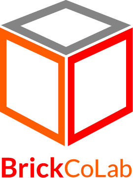
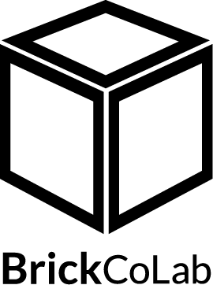
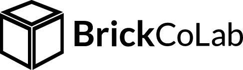

# branding

**Welcome to the BrickColab Brand Guidelines and Standards documentation. This guide is designed to apply our branding consistently across various media.**

**A brand is not simply a logo or a tagline. It is a whole identity built on a foundation of values and goals that represent CodeAdam.**

Please refer to the publications below for the brand guidelines which review the advertising themes we are using and how to execute these themes in our marketing materials. The quick reference guides are short, specific content sheets that help staff, faculty and their vendors use the brand correctly.

## CODEADAM LOGOS

<table>
<tr>
<td width="50%">

<h3>Primary Logo:</h3>

In most circumstances, the primary logo should be used any departments that do not have an approved sub-brand logo are to use the primary logo.

</td>
<td width="50%"></td>
</tr>
</table>

## LOGO COLOURS

<table>
<tr>
<td width="50%">

<h3>Coloured Logo</h3>

</td>
<td width="50%">

<h3>Monotone Logo (Black)</h3>

</td>
</tr>
</table>

<table style="width:100%;">
<tr>
<td width="33.3%">

<strong>ORANGE</strong>
 
CMYK: 0 79 100 0
 
RGB: 255 91 0
 
HEX: #ff5b00
 

</td>
<td width="33.3%">

<strong>RED</strong>
 
CMYK: 0 99 100 0
 
RGB: 255 0 0
 
HEX: #ff0000
 

</td>
<td width="33.3%">

<strong>GREY</strong>
 
CMYK: 6 6 4 0
 
RGB: 237 237 237
 
HEX: #ededed
 

</td>
</tr>
</table>

## DOWNLOADS

<table>
<tr>
<td width="50%">

<h3>Standard Coloured Logo</h3>

<ul>
<li></li>
</ul>

</td>
<td width="50%">

<h3>Standard Coloured Logo Horizontal</h3>

<ul>
<li></li>
</ul>

</td>
</tr>
<tr>
<td width="50%">

<h3>Standard Logo Black </h3>

<ul>
<li></li>
<li></li>
<li></li>
</ul>

</td>
<td width="50%">

<h3>Logo Black Horizontal</h3>

<ul>
<li></li>
<li></li>
<li></li>
</ul>

</td>
</tr>
</table>

## TYPOGRAPHY

- <a href="https://fonts.google.com/specimen/Lato" target="_blank">Lato Family Font from Google Fonts</a>
- <a href="https://fonts.google.com/specimen/PT+Sans" target="_blank">PT Sans Family Font from Google Fonts</a>

---

